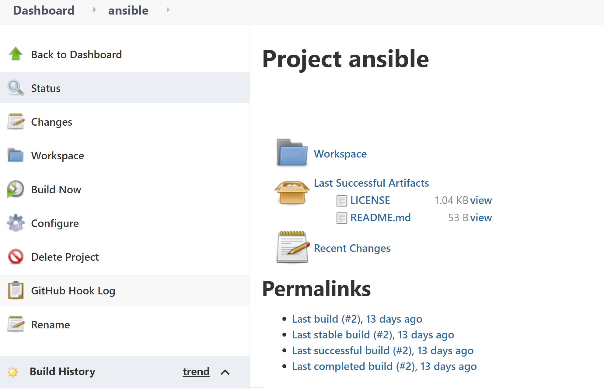
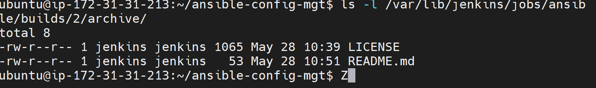
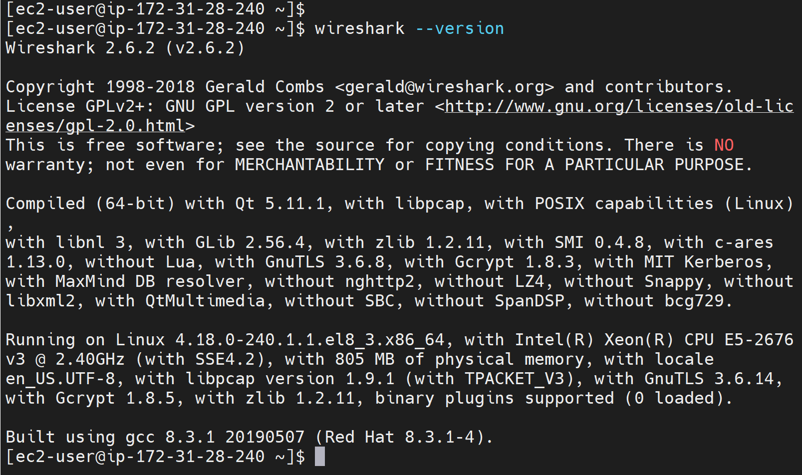
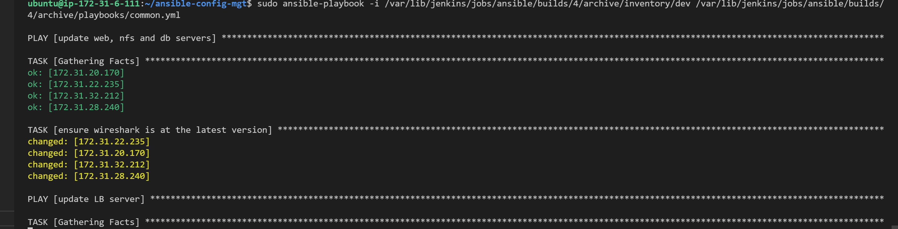

## Ansible Client as a Jump Server (Bastion Host)

* Jenkins server was updated to Jenkins-Ansible

* New repository was created
{https://github.com/aawodele/ansible-config-mgt.git}


### Step 1 - Install and configure Ansible on EC2 Instance


```
sudo apt update

sudo apt install ansible
```

* Configuration of Jenkins
* Create a new Freestyle project ansible in Jenkins and point it to your ‘ansible-config-mgt’ repository.



```
ls /var/lib/jenkins/jobs/ansible/builds/<build_number>/archive/
```




### Step 2 - Prepare your development environment using Visual Studio Code

* Virtual studio code installed and ansible-config-mgt repository was clone into it for connection


### Step 3 - Begin Ansible Development

* New branch created
```
sudo install git
```
```
git checkout -b feature-prj-11
```
```
mkdir playbooks
```
```
cd playboooks
```
```
touch common.yml
```
```
cd ..
```
```
mkdir inventory
```
```
cd inventory
```
```
touch dev staging uat prod
```
```
cd ..
```

### Step 4 - Set up an Ansible Inventory

* ssh configuration was made for connections between ansible controller and the nodes

* permission was given
```
chmod 400 key.pem
```

* update inventory/dev

```
[nfs]
172.31.22.235 ansible_ssh_user='ec2-user' ansible_ssh_private_key_file=<path-to-.pem-private-key>

[webservers]
172.31.28.240 ansible_ssh_user='ec2-user' ansible_ssh_private_key_file=<path-to-.pem-private-key>
172.31.20.170 ansible_ssh_user='ec2-user'

[db]
172.31.30.212 ansible_ssh_user='ec2-user' ansible_ssh_private_key_file=<path-to-.pem-private-key>

[lb]
172.31.32.212 ansible_ssh_user='ubuntu' ansible_ssh_private_key_file=<path-to-.pem-private-key>
```


### Step 5 - Create a Common Playbook

* Update playbooks/common.yml

```
---
- name: update web, nfs and db servers
  hosts: webservers, nfs, db
  remote_user: ec2-user
  become: yes
  become_user: root
  tasks:
  - name: ensure wireshark is at the latest version
    yum:
      name: wireshark
      state: latest

- name: update LB server
  hosts: lb
  remote_user: ubuntu
  become: yes
  become_user: root
  tasks:
  - name: ensure wireshark is at the latest version
    apt:
      name: wireshark
      state: latest
```




### Step 6 - Update GIT with the latest code

```

git status

git add .

git commit -m "commit prj-11"
```

* Create pull request

* Merge with the main
* Checkout of feature-prj-11 into main

```
git checkout main
```

### Step 7 - Run first Ansible test

```

ansible-playbook -i /var/lib/jenkins/jobs/ansible/builds/<build-number>/archive/inventory/dev.yml /var/lib/jenkins/jobs/ansible/builds/<build-number>/archive/playbooks/common.yml
Note: Previous command we ran without sudo, this is because we had added an ssh key to ssh-
```




