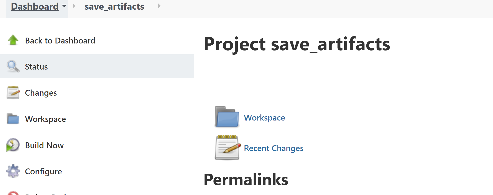
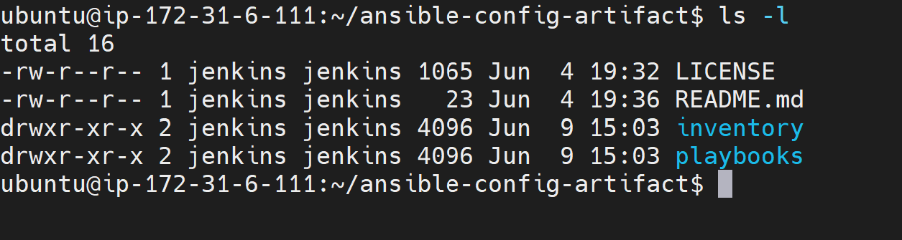
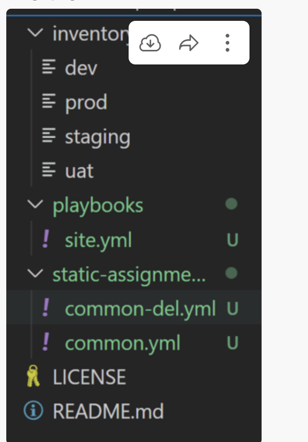
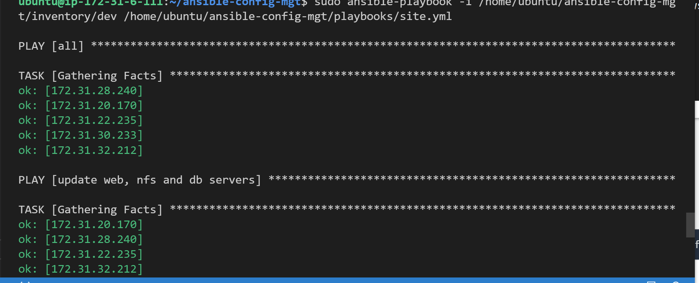
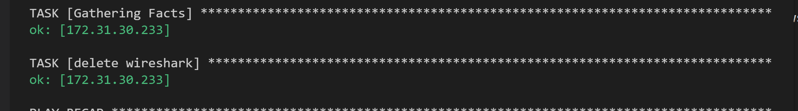
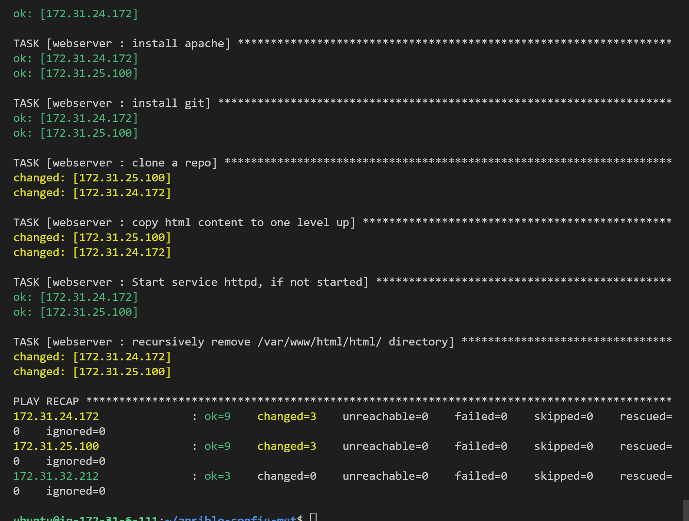
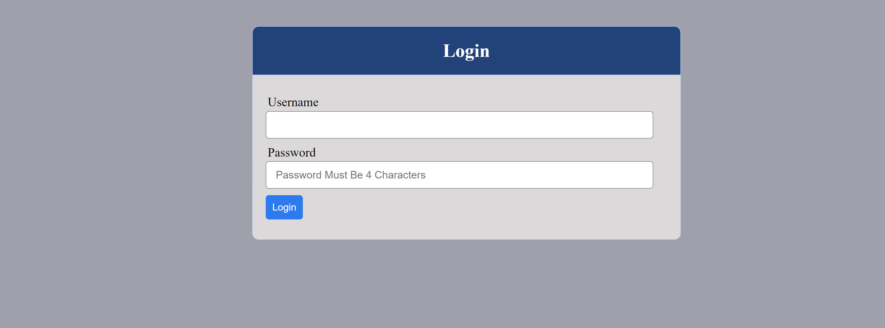

## Ansible Refactoring & Static Assignments (Imports and Roles)


### Step 1 - Jenkins job enhancement

```
sudo mkdir /home/ubuntu/ansible-config-artifact
```

* Change permissions
```
chmod -R 0777 /home/ubuntu/ansible-config-artifact
```

* Install Copy Artifact plugin on Jenkins

* update webhook on github

* Create a new freestyle named (save_artifacts)



* Testing set up 

```
/home/ubuntu/ansible-config-artifact
```


### Step 2 - Refactor Ansible code by importing other playbooks into site.yml

```
cd playbooks
```
```
touch site.yml
```
```
cd ..
```
```
mkdir static-assignment
```
 * mv **common.yml** file into **static-assignments folder**

 * Inside **site.yml** file , import **common.yml** playbook

 ```
 ---
- hosts: all
- import_playbook: ../static-assignments/common.yml
```



* Create another playbook **static-assignments** name it **common-del.yml**

* Configure deletion of wireshark utility in **common-del.yml**

```
---
- name: update web, nfs and db servers
  hosts: webservers, nfs, db
  remote_user: ec2-user
  become: yes
  become_user: root
  tasks:
  - name: delete wireshark
    yum:
      name: wireshark
      state: removed

- name: update LB server
  hosts: lb
  remote_user: ubuntu
  become: yes
  become_user: root
  tasks:
  - name: delete wireshark
    apt:
      name: wireshark-qt
      state: absent
      autoremove: yes
      purge: yes
      autoclean: yes
```

* Update ** site.yml** 
```
 import_playbook: ../static-assignments/common-del.yml
 ```

 ```
 sudo ansible-playbook -i /home/ubuntu/ansible-config-mgt/inventory/dev.yml /home/ubuntu/ansible-config-mgt/playbooks/site.yaml
 ```

 

 

 ### Step 3 - Configure UAT Webservers with a role ‘Webserver’

 * Lunch 2 instances name them **web1-uat** and **web2-uat** servers


 * Make a directory **roles** and create a role in the directory

 ```

 mkdir roles
cd roles
ansible-galaxy init webserver
```

* Create the directory/files structure manually

```
└── webserver
    ├── README.md
    ├── defaults
    │   └── main.yml
    ├── handlers
    │   └── main.yml
    ├── meta
    │   └── main.yml
    ├── tasks
    │   └── main.yml
    └── templates
```

* Update your inventory **ansible-config-mgt/inventory/uat.yml**


 ```
     [uat-webservers]
172.31.24.172 ansible_ssh_user='ec2-user' ansible_ssh_private_key_file=/home/ubuntu/.ssh/key.pem
172.31.25.100 ansible_ssh_user='ec2-user' ansible_ssh_private_key_file=/home/ubuntu/.ssh/key.pem
``` 

* Uncomment and grant full path in **/etc/ansible/ansible.cfg** in roles directory

* Add roles to the webservers role within **main.yml**

Install and configure 

Apache **httpd** service

Clone Tooling website from GitHub https://github.com/https://github.com/aawodele/tooling.git

Ensure the tooling website code is deployed to /var/www/html on each of 2 UAT Web servers

Make sure httpd service is started

**Main.yml** consist of the following

```

---
- name: install apache
  become: true
  ansible.builtin.yum:
    name: "httpd"
    state: present

- name: install git
  become: true
  ansible.builtin.yum:
    name: "git"
    state: present

- name: clone a repo
  become: true
  ansible.builtin.git:
    repo: https://github.com/<your-name>/tooling.git
    dest: /var/www/html
    force: yes

- name: copy html content to one level up
  become: true
  command: cp -r /var/www/html/html/ /var/www/

- name: Start service httpd, if not started
  become: true
  ansible.builtin.service:
    name: httpd
    state: started

- name: recursively remove /var/www/html/html/ directory
  become: true
  ansible.builtin.file:
    path: /var/www/html/html
    state: absent
```

## Step 4 - Reference ‘Webserver’ role

* Create a new assignment for **uat-webservers.yml** within **static-assignments** folder

```
---
- hosts: uat-webservers
  roles:
     - webserver
```

* Refer **uat-webservers.yml**
role inside **site.yml**

```
---
- hosts: all
- import_playbook: ../static-assignments/common.yml

- hosts: uat-webservers
- import_playbook: ../static-assignments/uat-webservers.yml
```

### Step 5 - Commit & Test

```
git add .
git commit -m "commit prj-12"
git push
```

* run the playbook against your **uat**

```
sudo ansible-playbook -i /home/ubuntu/ansible-config-mgt/inventory/uat.yml /home/ubuntu/ansible-config-mgt/playbooks/site.yml
```






