## Ansible Dynamic Assignments (Include) and Community Roles


### Introducing Dynamic Assignment Into Our structure

* Start a new branch **dynamic-assignments** in GitHub repository **https://github.com/aawodele/ansible-config-mgt.git**


* Create a new folder **dynamic-assignments** inside this folder create a new file **env-vars.yml**
```
mkdir dynamic-assignments

touch env-vars.yml
```
* Create a folder **env-vars** to keep each environment variables file


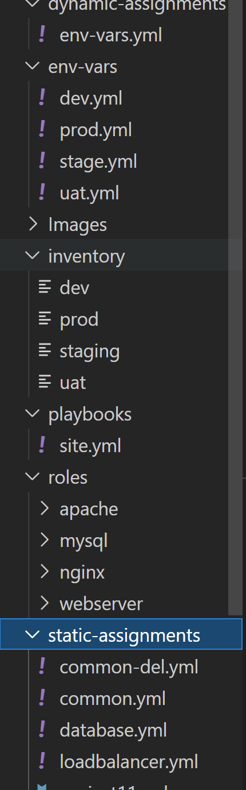


* Paste the following instruction into **env-vars.yml**

```
---
- name: collate variables from env specific file, if it exists
  include_vars: "{{ item }}"
  with_first_found:
    - "{{ playbook_dir }}/../env_vars/{{ "{{ inventory_file }}.yml"
    - "{{ playbook_dir }}/../env_vars/default.yml"
  tags:
    - always

```

## Update site.yml with dynamic assignments

* Update **site.yml** file to make use of the dynamic assignment


**site.yml**
```
---
- name: Include dynamic variables 
  hosts: all
  tasks:
    - import_playbook: ../static-assignments/common.yml 
    - include_playbook: ../dynamic-assignments/env-vars.yml
  tags:
    - always

- name: Webserver assignment
  hosts: webservers
    - import_playbook: ../static-assignments/webservers.yml
```

* Make a commit and push to master your ‘ansible-config-mgt’ directory in other to preserve GitHub actual state

```
git init
git pull https://github.com/aawodele/ansible-config-mgt.git/ansible-config-mgt.git
git remote add origin https://github.com/aawodele/ansible-config-mgt.git/ansible-config-mgt.git
git branch roles-feature
git switch roles-feature
```

```
cd roles
```

```
ansible-galaxy install geerlingguy.mysql -P ~/ansible-config-mgt/roles
```

```
mv geerlingguy.mysql/ mysql
```
* Read the **README.md** file and edit roles configuration to use correct credentials for MySQL required for the tooling website.

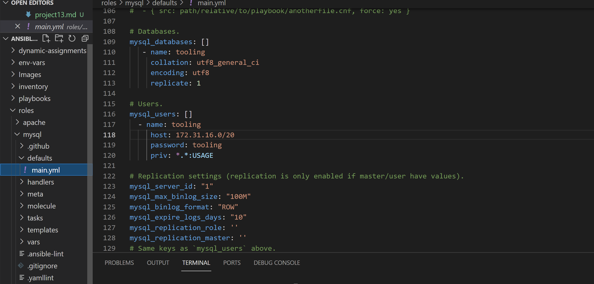

*  Upload the changes into GitHub
```
git add .
git commit -m "Commit new role files into GitHub"
git push --set-upstream origin roles-feature
```

### Load Balancer roles

* Nginx roles

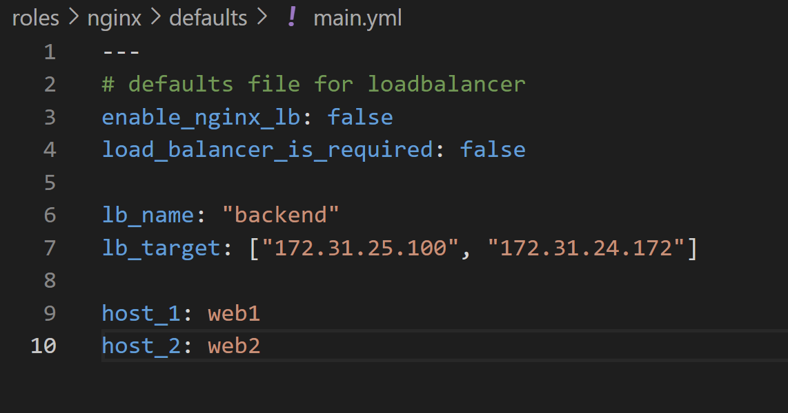

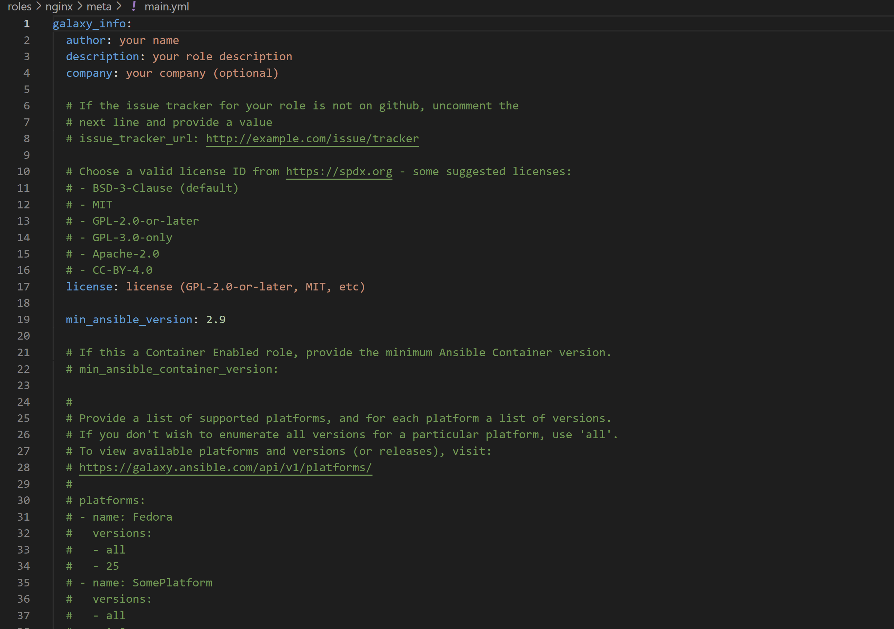

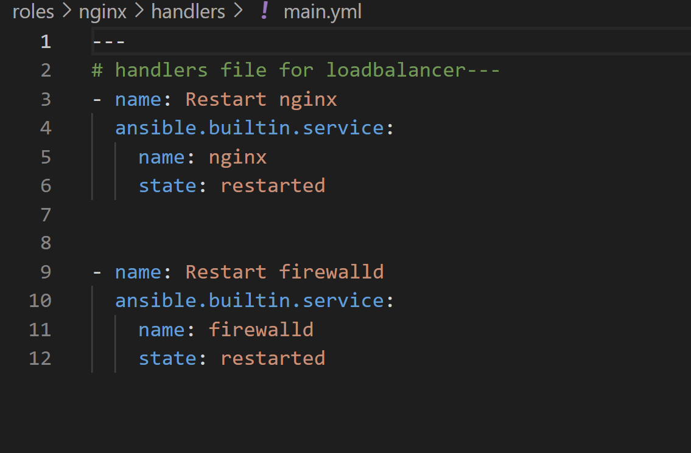

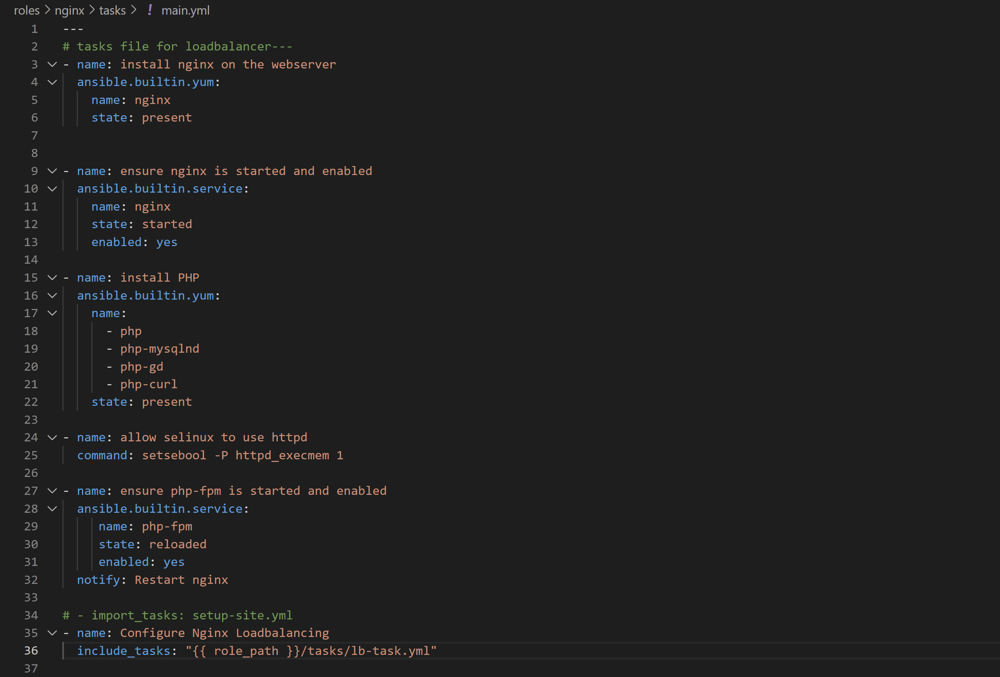

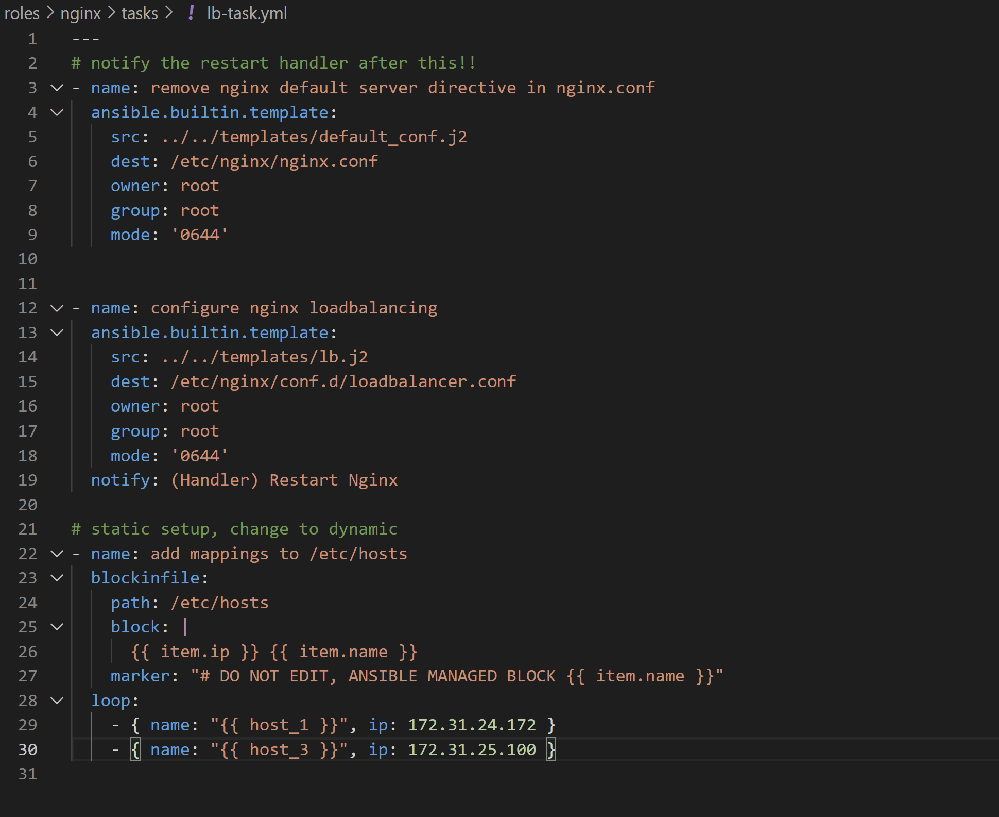
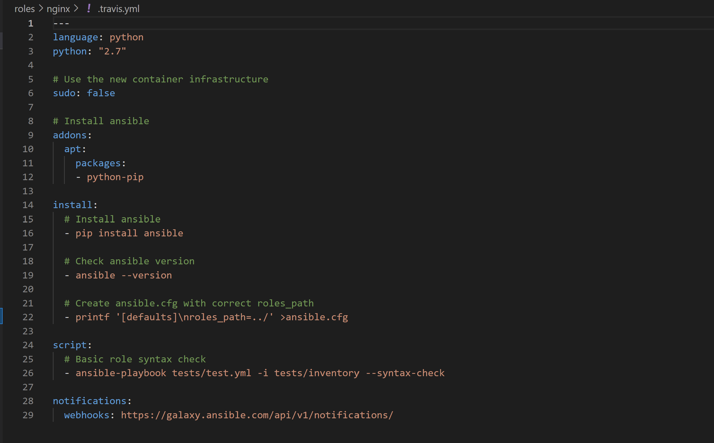
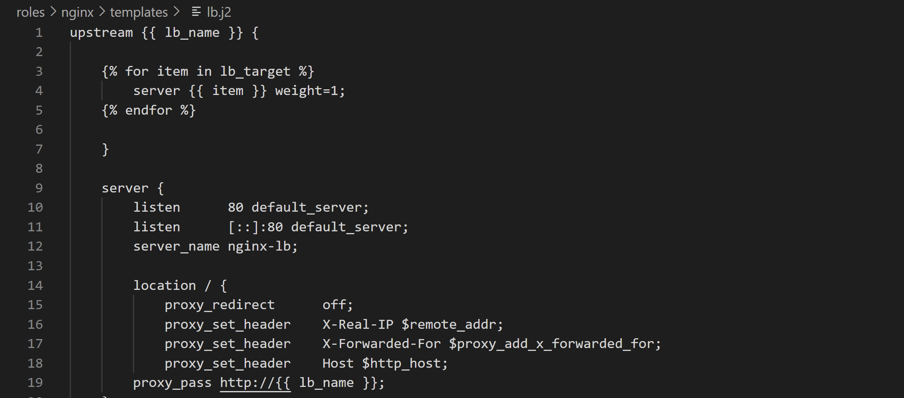

* Apache roles
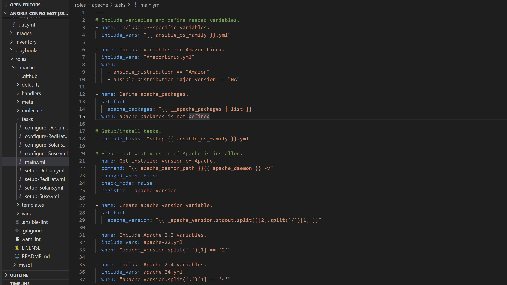
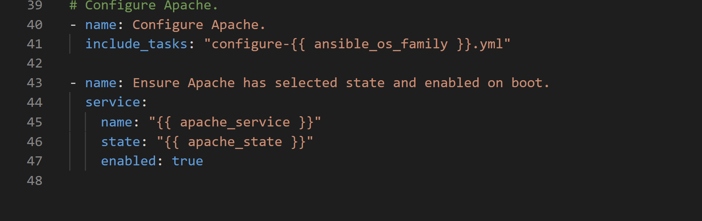


* mysql roles
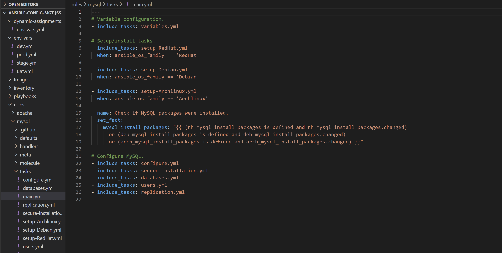


* Update both **static-assignment** and **site.yml** files to refer the roles

**static-assignment**
**loadbalancers.yml**

```
- hosts: lb
  roles:
    - { role: nginx, when: enable_nginx_lb and load_balancer_is_required }
    - { role: apache, when: enable_apache_lb and load_balancer_is_required }
  ```
  **site.yml**
  ```
   - name: Loadbalancers assignment
       hosts: lb
         - import_playbook: ../static-assignments/loadbalancers.yml
        when: load_balancer_is_required 
      
  ```
  **env-vars\uat.yml**

  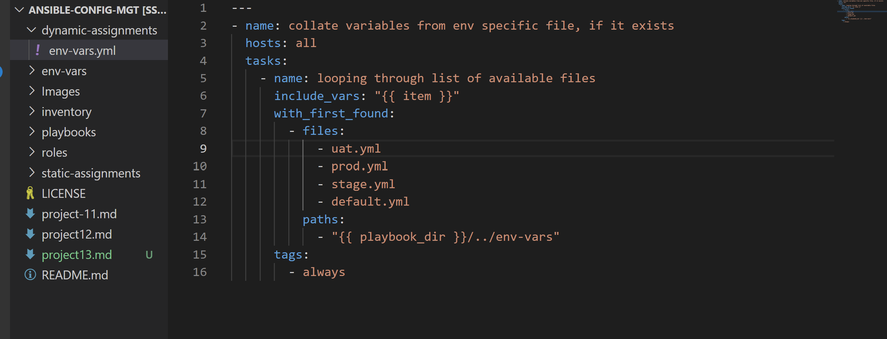


* Enable Nginx by setting**env-vars** (UAT.yml) file to activate loadbalancer 

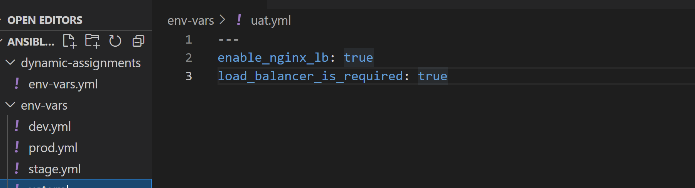


* Test ansible **uat.yml**

```
ansible-playbook -i ../inventory/uat ../playbook/site.yml
```
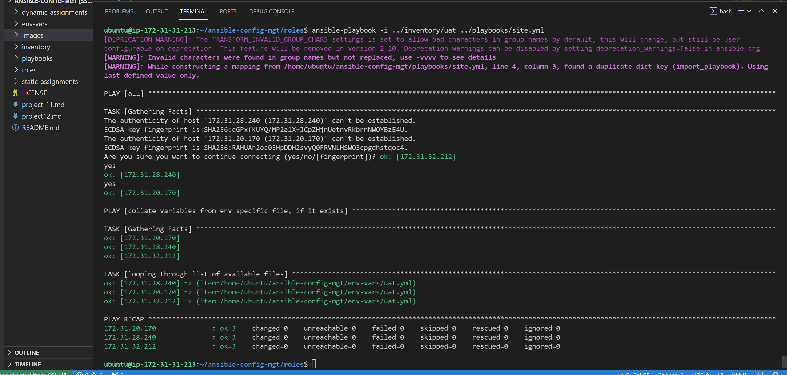